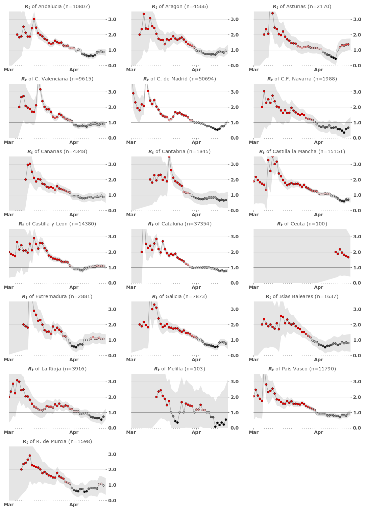
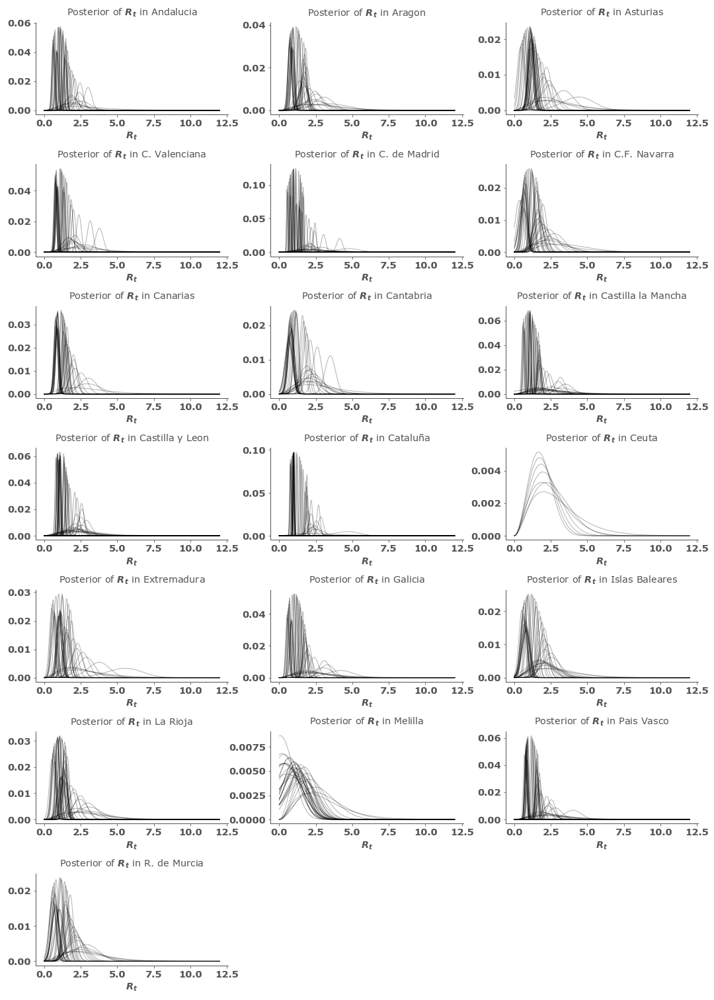

# Estimating SARS-Cov-2 outbreak basic reproduction number by Autonomous community in Spain

   
  <figcaption>Estimation of SARS-Cov-2 Rt in regions of Spain</figcaption>

 
 

   
  <figcaption>Posterior probability of SARS-Cov-2 R_t in regions of Spain</figcaption>

Data source: https://covid19.isciii.es/

Stuff presented in [notebooks/1.0-modeling_rt_spain.ipynb](https://gitlab.com/fpozoc/covid-rt/-/blob/master/notebooks/1.0-modeling_rt_spain.ipynb).

Initially forked from: https://github.com/k-sys/covid-19/blob/master/Realtime%20R0.ipynb